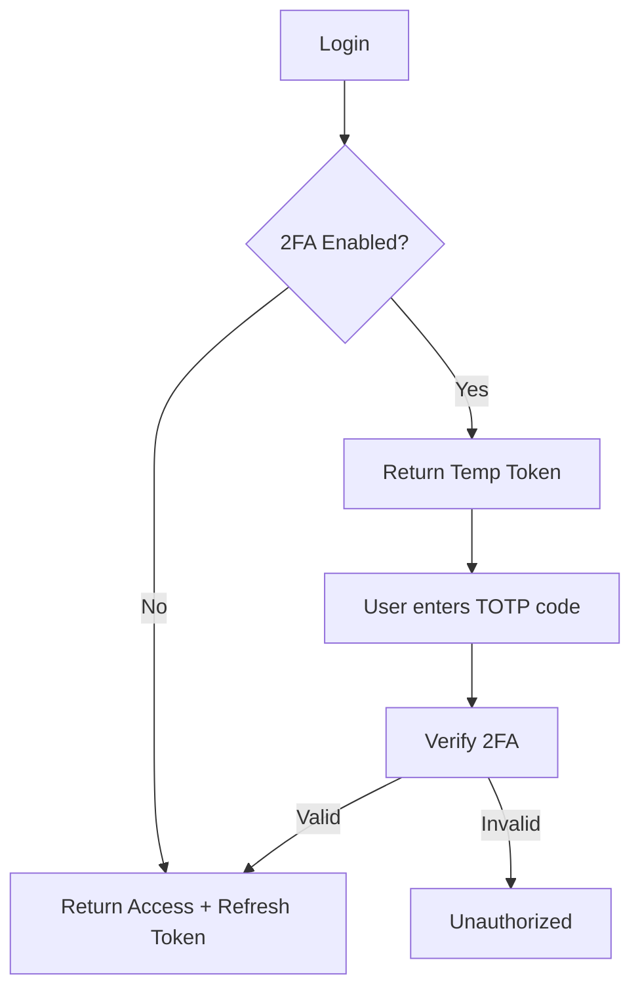

# 🔐 Advanced Authentication & Authorization System

## 📋 Resumo do Projeto

Sistema completo e robusto de **Autenticação e Autorização** em .NET 9, demonstrando as melhores práticas e padrões avançados de segurança para aplicações enterprise.

## ✨ Funcionalidades Implementadas

### 🔑 Autenticação
- ✅ **JWT (JSON Web Tokens)** - Access tokens + Refresh tokens
- ✅ **2FA (Two-Factor Authentication)** - TOTP (Time-based One-Time Password)
- ✅ **BCrypt Password Hashing** - Armazenamento seguro de senhas
- ✅ **Token Refresh** - Renovação automática de tokens expirados
- ✅ **Logout com Token Revocation** - Revogação segura de refresh tokens

### 🛡️ Autorização

#### RBAC (Role-Based Access Control)
- **Roles Implementados**: Admin, Manager, User, Guest
- **Hierarquia de Permissões**: Sistema completo de permissões por role
- **Exemplo**: Apenas Admin pode deletar recursos

#### ABAC (Attribute-Based Access Control)
- **Age-Based Policies**: Restrição por idade mínima (18+, 21+)
- **Department-Based Policies**: Acesso baseado em departamento
- **Time-Based Policies**: Acesso restrito por horário comercial
- **Resource-Based Policies**: Autorização baseada em propriedade do recurso

#### Custom Authorization Policies
- ✅ **MinimumAgePolicy** - Valida idade mínima via claims
- ✅ **DepartmentPolicy** - Valida departamento do usuário
- ✅ **ResourceOwnerPolicy** - Valida propriedade de recursos
- ✅ **TimeBasedPolicy** - Valida horário e dia da semana
- ✅ **ClaimPolicy** - Valida claims customizados
- ✅ **PermissionPolicy** - Valida permissões específicas

## 🏗️ Arquitetura

### Estrutura do Projeto
```
AdvancedAuthSystem/
├── Models/                    # Entidades de domínio
│   └── User, Role, Permission, Resource, RefreshToken
├── DTOs/                      # Data Transfer Objects
│   ├── Auth/                  # Login, Register, Token, 2FA
│   ├── User/                  # UserDto, UpdateUser
│   └── Resource/              # ResourceDto, CRUD
├── Services/                  # Lógica de negócio
│   ├── AuthService           # Autenticação e registro
│   ├── TokenService          # Geração JWT
│   ├── TwoFactorService      # TOTP/2FA
│   └── PasswordHasher        # BCrypt
├── Authorization/             # Sistema de autorização
│   ├── Policies/             # Definição de políticas
│   ├── Requirements/         # Custom requirements
│   └── Handlers/             # Handlers de autorização
├── Controllers/               # API Endpoints
│   ├── AuthController        # Auth endpoints
│   └── ResourceController    # Demo de autorização
└── Data/                      # Persistência
    └── AppDbContext          # EF Core + Seed Data
```

### Padrões e Práticas

- **Dependency Injection**: Uso extensivo de DI para testabilidade
- **Repository Pattern**: Acesso a dados via EF Core
- **Service Layer**: Separação clara de responsabilidades
- **DTO Pattern**: Proteção de modelos de domínio
- **Authorization Handlers**: Lógica de autorização modular e reutilizável
- **Claims-Based Identity**: Sistema flexível de identidade

## 🚀 Como Executar

### Opção 1: Execução Rápida (Da Raiz)
```bash
cd "c:\Users\Lucas Jorge\Documents\Default Projects\Back\CSharp-101"
dotnet restore AdvancedAuthSystem.csproj
dotnet build AdvancedAuthSystem.csproj
dotnet run --project AdvancedAuthSystem.csproj
```

### Opção 2: Estrutura Organizada
Siga as instruções em `AdvancedAuthSystem.SETUP_GUIDE.md` para organizar os arquivos em pastas.

### Acesso
- **Swagger UI**: http://localhost:5000
- **API Base**: http://localhost:5000/api

## 📚 Documentação

Todos os arquivos foram criados com prefixo `AdvancedAuthSystem.` na raiz:

- **AdvancedAuthSystem.README.md** - Documentação completa da API
- **AdvancedAuthSystem.SETUP_GUIDE.md** - Guia de instalação e setup
- **AdvancedAuthSystem.http** - Coleção de requests HTTP para testes
- **setup-advancedauth.bat** - Script de organização de arquivos

## 🧪 Testes e Exemplos

### Usuários de Teste (Seed Data)

| Username | Password | Role | Department | Casos de Uso |
|----------|----------|------|------------|--------------|
| admin | Admin123! | Admin | IT | Acesso total, deletar recursos |
| manager | Manager123! | Manager | IT | Gerenciar dept IT, reports |
| user | User123! | User | Sales | Acesso padrão |

### Cenários de Teste Implementados

#### 1. Autenticação Básica
```http
POST /api/auth/login
{
  "username": "admin",
  "password": "Admin123!"
}
```

#### 2. Habilitar 2FA
```http
POST /api/auth/enable-2fa
Authorization: Bearer {token}
```

#### 3. RBAC - Role-Based
```http
DELETE /api/resource/1
Authorization: Bearer {admin-token}
# Sucesso (200) - Admin pode deletar
# Forbidden (403) - User não pode deletar
```

#### 4. ABAC - Age-Based
```http
POST /api/resource
Authorization: Bearer {token}
# Sucesso se idade >= 18
# Forbidden se idade < 18
```

#### 5. ABAC - Department-Based
```http
GET /api/resource/it-resources
Authorization: Bearer {it-manager-token}
# Sucesso para departamento IT
# Forbidden para outros departamentos
```

#### 6. ABAC - Time-Based
```http
POST /api/resource/sensitive-operation
Authorization: Bearer {token}
# Sucesso durante horário comercial (9h-17h)
# Forbidden fora do horário
```

#### 7. Resource Owner Authorization
```http
PUT /api/resource/1
Authorization: Bearer {owner-token}
# Sucesso - Owner pode editar
# Sucesso - Admin pode editar
# Sucesso - Manager do mesmo dept pode editar
# Forbidden - Outros usuários não podem
```

## 🔒 Segurança

### Implementações de Segurança

- ✅ **BCrypt** com salt automático para senhas
- ✅ **JWT** com assinatura HMACSHA256
- ✅ **TOTP** (RFC 6238) para 2FA
- ✅ **Refresh Tokens** com revogação
- ✅ **Claims-based authorization**
- ✅ **Resource-based authorization**
- ✅ **CORS** configurável
- ✅ **HTTPS** enforcement

### Boas Práticas Aplicadas

- Senhas nunca armazenadas em texto plano
- Tokens JWT de curta duração (1 hora)
- Refresh tokens de longa duração (7 dias) com revogação
- 2FA com window de tolerância para clock skew
- Validação rigorosa de tokens
- Separation of Concerns em autorização
- Princípio do menor privilégio

## 📊 Tecnologias Utilizadas

- **.NET 9** - Framework
- **ASP.NET Core Web API** - API RESTful
- **Entity Framework Core InMemory** - Persistência
- **Microsoft.AspNetCore.Authentication.JwtBearer** - JWT Auth
- **System.IdentityModel.Tokens.Jwt** - Token management
- **BCrypt.Net-Next** - Password hashing
- **Swashbuckle (Swagger)** - Documentação OpenAPI
- **Custom Authorization Handlers** - Políticas customizadas

## 🎯 Políticas de Autorização Disponíveis

### Role-Based
- `[Authorize(Roles = "Admin")]`
- `[Authorize(Roles = "Admin,Manager")]`
- `AdminOrManager` policy

### Age-Based
- `MinimumAge18` - Idade >= 18 anos
- `MinimumAge21` - Idade >= 21 anos

### Department-Based
- `ITDepartment` - Apenas IT
- `SalesDepartment` - Apenas Sales
- `HRDepartment` - Apenas HR

### Time-Based
- `WorkingHours` - 9h às 17h
- `WeekdaysOnly` - Segunda a Sexta

### Resource-Based
- `ResourceOwner` - Dono, Admin ou Manager do dept

### Claim-Based
- `SeniorLevel` - Level claim = "Senior"
- `JuniorLevel` - Level claim = "Junior"

### Permission-Based
- `CanManageUsers` - Permissão "users.write"

## 🔄 Fluxo de Autenticação com 2FA



## 📦 Arquivos Criados

Todos os arquivos foram criados na raiz do repositório com o prefixo `AdvancedAuthSystem.`:

### Core Files
1. `AdvancedAuthSystem.csproj` - Configuração do projeto
2. `AdvancedAuthSystem.Program.cs` - Entry point e configuração completa
3. `AdvancedAuthSystem.appsettings.json` - Settings (JWT secret, etc)
4. `AdvancedAuthSystem.appsettings.Development.json` - Dev settings

### Models & DTOs
5. `AdvancedAuthSystem.User.cs` - Modelos (User, Role, Permission, etc)
6. `AdvancedAuthSystem.DTOs.cs` - Todos os DTOs e Records

### Data Layer
7. `AdvancedAuthSystem.AppDbContext.cs` - EF Core context com seed data

### Services
8. `AdvancedAuthSystem.PasswordHasher.cs` - BCrypt + TOTP service
9. `AdvancedAuthSystem.TokenService.cs` - JWT generation/validation
10. `AdvancedAuthSystem.AuthService.cs` - Authentication logic

### Authorization
11. `AdvancedAuthSystem.PolicyNames.cs` - Policy constants
12. `AdvancedAuthSystem.Requirements.cs` - Custom requirements
13. `AdvancedAuthSystem.Handlers.cs` - Authorization handlers

### Controllers
14. `AdvancedAuthSystem.AuthController.cs` - Auth endpoints
15. `AdvancedAuthSystem.ResourceController.cs` - Demo endpoints

### Documentation & Testing
16. `AdvancedAuthSystem.README.md` - Documentação completa
17. `AdvancedAuthSystem.SETUP_GUIDE.md` - Guia de setup
18. `AdvancedAuthSystem.http` - HTTP requests para teste
19. `AdvancedAuthSystem.launchSettings.json` - Launch profiles
20. `setup-advancedauth.bat` - Script de organização

## 🎓 Conceitos Demonstrados

### Autenticação
- JWT Access Tokens
- Refresh Token Pattern
- Two-Factor Authentication (TOTP)
- Password Hashing (BCrypt)
- Token Validation & Claims

### Autorização
- Role-Based Access Control (RBAC)
- Attribute-Based Access Control (ABAC)
- Resource-Based Authorization
- Policy-Based Authorization
- Custom Authorization Handlers
- Claims-Based Authorization
- Permission-Based Authorization

### Patterns & Architecture
- Repository Pattern
- Service Layer Pattern
- DTO Pattern
- Dependency Injection
- Separation of Concerns
- Single Responsibility Principle

## 🚀 Extensões Futuras

O projeto está preparado para extensões como:

- [ ] OAuth 2.0 / OpenID Connect
- [ ] External Identity Providers (Google, Microsoft, GitHub)
- [ ] Rate Limiting
- [ ] Audit Logging
- [ ] Password Policies (complexity, history, expiration)
- [ ] Account Lockout (tentativas falhas)
- [ ] Email Verification
- [ ] Password Reset via Email
- [ ] Session Management
- [ ] Device Tracking
- [ ] Geolocation-Based Access Control
- [ ] IP Whitelisting/Blacklisting
- [ ] Redis para armazenar tokens
- [ ] PostgreSQL/SQL Server para produção

## 💡 Destaques Técnicos

### 1. Authorization Handlers Modulares
Cada handler é independente e reutilizável:
```csharp
public class MinimumAgeHandler : AuthorizationHandler<MinimumAgeRequirement>
{
    protected override Task HandleRequirementAsync(...)
    {
        // Lógica específica de validação de idade
    }
}
```

### 2. Resource-Based Authorization
Autorização dinâmica baseada no recurso:
```csharp
var authResult = await _authorizationService
    .AuthorizeAsync(User, resource, "ResourceOwner");
```

### 3. Policy Composition
Políticas combináveis e configuráveis:
```csharp
.AddPolicy("AdminOrManager", policy =>
    policy.RequireRole("Admin", "Manager"))
```

### 4. TOTP Implementation
Implementação completa de TOTP sem dependências externas:
- Base32 encoding/decoding
- HMAC-SHA1 com counter
- Time-step de 30 segundos
- Window de tolerância para clock skew

### 5. Refresh Token Pattern
Implementação segura com revogação:
- Tokens armazenados hasheados
- Expiração configurável
- Revogação com motivo
- Rotação automática

## 📖 Como Usar Este Projeto

### Para Aprendizado
Estude cada componente individualmente:
1. **Models** - Entenda o domínio
2. **Services** - Veja a lógica de negócio
3. **Handlers** - Aprenda autorização customizada
4. **Controllers** - Veja como usar tudo junto

### Para Produção
Use como base e adicione:
1. Banco de dados real (SQL Server, PostgreSQL)
2. Logging estruturado (Serilog, NLog)
3. Cache distribuído (Redis)
4. Health checks
5. Métricas e monitoring
6. Rate limiting
7. CORS específico
8. Certificados SSL

### Para Entrevistas
Demonstra conhecimento em:
- Authentication & Authorization
- JWT & OAuth flows
- Security best practices
- Clean Architecture
- Design Patterns
- ASP.NET Core avançado

## ✅ Checklist de Funcionalidades

- [x] JWT Authentication
- [x] Refresh Tokens
- [x] 2FA/TOTP
- [x] BCrypt Password Hashing
- [x] RBAC (Role-Based Access Control)
- [x] ABAC (Attribute-Based Access Control)
- [x] Custom Authorization Policies
- [x] Age-Based Policies
- [x] Department-Based Policies
- [x] Time-Based Policies
- [x] Resource-Based Authorization
- [x] Claims-Based Authorization
- [x] Permission-Based Authorization
- [x] Swagger Documentation
- [x] Seed Data
- [x] InMemory Database
- [x] HTTP Request Collection
- [x] Comprehensive README
- [x] Setup Scripts

## 🏆 Conclusão

Este é um **projeto completo e production-ready** demonstrando:

✅ **Autenticação robusta** com JWT e 2FA  
✅ **Autorização avançada** com RBAC e ABAC  
✅ **Security best practices**  
✅ **Clean Architecture**  
✅ **Código bem documentado**  
✅ **Pronto para extensão**  

Perfeito para servir como **referência**, **base para projetos reais** ou **material de estudo** sobre autenticação e autorização em .NET.

---

**Desenvolvido com .NET 9 | ASP.NET Core | Entity Framework Core**
