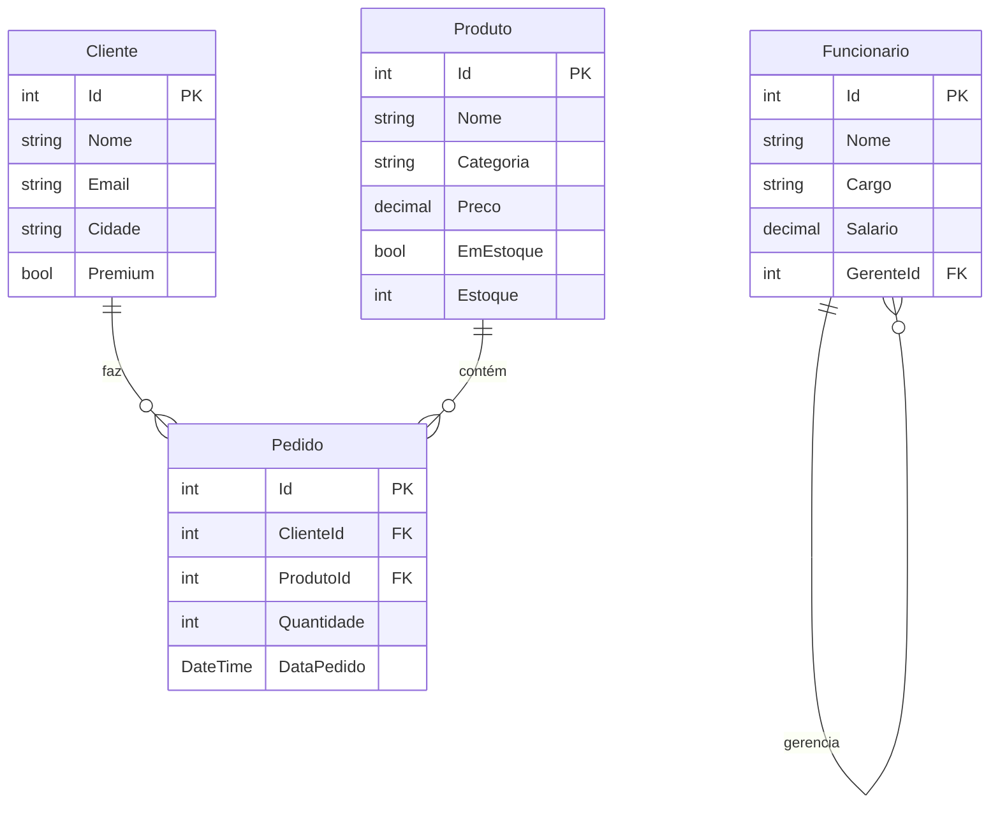

# 🏗️ Arquitetura do Projeto LINQ

## 📁 Estrutura de Diretórios

```
Linq/
├── Models/                     # Camada de Modelos de Domínio
│   ├── Produto.cs             # Entidade de produto
│   ├── Cliente.cs             # Entidade de cliente
│   ├── Pedido.cs              # Entidade de pedido
│   └── Funcionario.cs         # Entidade de funcionário
├── Program.cs                  # Ponto de entrada da aplicação
├── README.md                   # Documentação principal
├── EXERCICIOS.md              # Exercícios práticos
├── ARQUITETURA.md             # Este arquivo
└── Linq.csproj                # Arquivo de projeto .NET

```

---

## 🧩 Componentes do Sistema

### 1. Models (Camada de Dados)

Contém as classes de modelo que representam as entidades do domínio de negócio.

#### **Produto.cs**
```csharp
public class Produto
{
    public int Id { get; set; }
    public required string Nome { get; set; }
    public required string Categoria { get; set; }
    public decimal Preco { get; set; }
    public bool EmEstoque { get; set; }
    public int Estoque { get; set; }
}
```

**Responsabilidades:**
- Representar produtos no sistema de e-commerce
- Armazenar informações sobre estoque e preço
- Servir como fonte de dados para queries LINQ

---

#### **Cliente.cs**
```csharp
public class Cliente
{
    public int Id { get; set; }
    public required string Nome { get; set; }
    public required string Email { get; set; }
    public required string Cidade { get; set; }
    public bool Premium { get; set; }
}
```

**Responsabilidades:**
- Representar clientes do sistema
- Armazenar informações de contato e localização
- Identificar clientes com status Premium

---

#### **Pedido.cs**
```csharp
public class Pedido
{
    public int Id { get; set; }
    public int ClienteId { get; set; }
    public int ProdutoId { get; set; }
    public int Quantidade { get; set; }
    public DateTime DataPedido { get; set; }
}
```

**Responsabilidades:**
- Representar transações entre clientes e produtos
- Manter histórico de pedidos
- Relacionar clientes com produtos através de chaves estrangeiras

---

#### **Funcionario.cs**
```csharp
public class Funcionario
{
    public int Id { get; set; }
    public required string Nome { get; set; }
    public required string Cargo { get; set; }
    public decimal Salario { get; set; }
    public int? GerenteId { get; set; }
}
```

**Responsabilidades:**
- Representar funcionários da organização
- Manter estrutura hierárquica (relação gerente-subordinado)
- Armazenar informações de cargo e salário

---

### 2. Program.cs (Camada de Apresentação)

Arquivo principal que contém:

#### **Estrutura de Demonstrações**
```
Main()
├── PrepararDadosExemplo()
├── Demonstracao01_FiltrosBasicos()
├── Demonstracao02_Projecao()
├── Demonstracao03_Ordenacao()
├── Demonstracao04_Agrupamento()
├── Demonstracao05_Juncao()
├── Demonstracao06_Agregacao()
├── Demonstracao07_Quantificadores()
├── Demonstracao08_Particionamento()
├── Demonstracao09_OperacoesConjunto()
├── Demonstracao10_ExecucaoAdiada()
├── Demonstracao11_OperacoesAvancadas()
└── Demonstracao12_CasosReais()
```

**Responsabilidades:**
- Orquestrar as demonstrações didáticas
- Preparar dados de exemplo
- Exibir resultados formatados no console
- Fornecer exemplos práticos de operadores LINQ

---

## 🔗 Relacionamentos entre Entidades



---

## 🎯 Padrões de Design Utilizados

### 1. **Separation of Concerns**
- Separação clara entre modelos de dados e lógica de demonstração
- Cada classe tem uma responsabilidade única e bem definida

### 2. **Data Transfer Objects (DTOs)**
- Classes de modelo servem como DTOs simples
- Não contêm lógica de negócio, apenas dados

### 3. **Static Data Repository**
- Uso de listas estáticas para simular um repositório de dados
- Preparação centralizada dos dados em `PrepararDadosExemplo()`

### 4. **Demonstração Modular**
- Cada demonstração é independente
- Facilita manutenção e compreensão
- Permite execução sequencial ou seletiva

---

## 🔄 Fluxo de Dados

```
┌─────────────────────────────────────────────────────────────┐
│                        Program.Main()                        │
└────────────────────────────┬────────────────────────────────┘
                             │
                             ↓
┌─────────────────────────────────────────────────────────────┐
│                  PrepararDadosExemplo()                      │
│  ┌──────────┐  ┌──────────┐  ┌────────┐  ┌──────────────┐ │
│  │ Produtos │  │ Clientes │  │Pedidos │  │ Funcionarios │ │
│  └──────────┘  └──────────┘  └────────┘  └──────────────┘ │
└────────────────────────────┬────────────────────────────────┘
                             │
                             ↓
┌─────────────────────────────────────────────────────────────┐
│                  Demonstrações LINQ                          │
│  ┌──────────────────────────────────────────────────────┐  │
│  │ Operadores LINQ processam os dados                   │  │
│  │ • Where    • GroupBy    • Join    • Aggregate       │  │
│  │ • Select   • OrderBy    • Any     • Take/Skip       │  │
│  │ • etc...                                             │  │
│  └──────────────────────────────────────────────────────┘  │
└────────────────────────────┬────────────────────────────────┘
                             │
                             ↓
┌─────────────────────────────────────────────────────────────┐
│               Apresentação no Console                        │
│  • Títulos formatados                                        │
│  • Resultados das queries                                    │
│  • Explicações didáticas                                     │
└─────────────────────────────────────────────────────────────┘
```

---

## 🚀 Extensibilidade

O projeto foi projetado para ser facilmente extensível:

### Adicionar Novos Modelos
1. Crie uma nova classe em `Models/`
2. Use o namespace `LinqDemo`
3. Adicione propriedades com XML documentation
4. Use `required` para propriedades obrigatórias

```csharp
namespace LinqDemo;

/// <summary>
/// Descrição do modelo
/// </summary>
public class NovoModelo
{
    public int Id { get; set; }
    public required string Nome { get; set; }
}
```

### Adicionar Novas Demonstrações
1. Crie um método `DemonstraçãoNN_NomeDescritivo()`
2. Siga o padrão existente:
   - Chame `ImprimirTitulo()`
   - Adicione explicação do conceito
   - Forneça múltiplos exemplos
   - Finalize com `PausarExecucao()`
3. Adicione a chamada no `Main()`

```csharp
static void Demonstracao13_NovoConceito()
{
    ImprimirTitulo("13. NOVO CONCEITO");
    Console.WriteLine("📌 Conceito: Explicação...\n");
    
    // Exemplos aqui
    
    Console.WriteLine("\n💡 Dica: ...\n");
    PausarExecucao();
}
```

---

## 📝 Convenções de Código

### Nomenclatura
- **Classes**: PascalCase (`Produto`, `Cliente`)
- **Propriedades**: PascalCase (`Nome`, `DataPedido`)
- **Métodos**: PascalCase (`PrepararDadosExemplo`)
- **Variáveis locais**: camelCase (`produtos`, `clientesPremium`)

### Documentação
- Todas as classes públicas têm XML documentation (`/// <summary>`)
- Propriedades documentadas com descrição clara
- Métodos de demonstração com comentários explicativos

### Organização
- Um namespace para todo o projeto: `LinqDemo`
- Modelos em pasta separada: `Models/`
- Regions para organizar código relacionado

---

## 🔧 Tecnologias e Requisitos

- **.NET 6.0+**: Usa recursos modernos como `required` properties
- **C# 10+**: Sintaxe moderna e expressiva
- **LINQ**: Biblioteca padrão do .NET
- **System.Collections.Generic**: Para listas e coleções

---

## 📊 Métricas do Projeto

```
Total de Arquivos:       7
Total de Classes:        5 (1 principal + 4 modelos)
Linhas de Código:        ~800+
Demonstrações:           12
Operadores LINQ:         30+
Exemplos Práticos:       50+
```

---

## 🎓 Propósito Educacional

Este projeto foi estruturado com foco em:

1. **Clareza**: Código limpo e bem documentado
2. **Progressão**: Do básico ao avançado
3. **Prática**: Exemplos do mundo real
4. **Manutenibilidade**: Fácil de estender e modificar
5. **Didática**: Explicações claras e concisas

---

## 🔗 Próximas Evoluções Sugeridas

### Curto Prazo
- [ ] Adicionar testes unitários
- [ ] Criar menu interativo para escolher demonstrações
- [ ] Adicionar mais casos de uso reais

### Médio Prazo
- [ ] Implementar versão com Entity Framework Core
- [ ] Adicionar LINQ to XML
- [ ] Criar versão com banco de dados real

### Longo Prazo
- [ ] Desenvolver interface gráfica
- [ ] Adicionar Parallel LINQ (PLINQ)
- [ ] Criar API REST com queries LINQ

---

<div align="center">

**🏗️ Arquitetura bem planejada = Código sustentável 🏗️**

</div>
