# 🚀 Guia Completo: Sistema de Autenticação com ASP.NET Core e JWT

## 📋 Índice

1. [Visão Geral](#-visão-geral)
2. [Pré-requisitos](#-pré-requisitos)
3. [Criação do Projeto](#-criação-do-projeto)
4. [Estrutura e Arquitetura](#-estrutura-e-arquitetura)
5. [Implementação Passo a Passo](#-implementação-passo-a-passo)
6. [Modelagem de Roles por Negócio](#-modelagem-de-roles-por-negócio)
7. [Frontend e Interface](#-frontend-e-interface)
8. [Testes e Validação](#-testes-e-validação)
9. [Preparação para Deploy](#-preparação-para-deploy)
10. [Boas Práticas e Segurança](#-boas-práticas-e-segurança)

---

## 🎯 Visão Geral

Este guia ensina como criar um sistema de autenticação completo e profissional com:

- **Backend**: ASP.NET Core Web API
- **Autenticação**: JWT (JSON Web Tokens)
- **Autorização**: Baseada em Roles
- **Banco de Dados**: Entity Framework (InMemory para desenvolvimento)
- **Frontend**: HTML5, CSS3, JavaScript (Vanilla)
- **Segurança**: BCrypt, CORS, Validação
- **Funcionalidades**: Login, Registro, Dashboard, Admin Panel, Troca de Senha

### 🏗️ Arquitetura do Sistema

```
┌─────────────────┐    ┌─────────────────┐    ┌─────────────────┐
│   Frontend      │    │   Backend API   │    │   Database      │
│   (HTML/JS/CSS) │◄──►│   (ASP.NET)     │◄──►│   (EF Core)     │
└─────────────────┘    └─────────────────┘    └─────────────────┘
```

---

## 🛠️ Pré-requisitos

### Software Necessário
```bash
# .NET SDK 9.0 ou superior
https://dotnet.microsoft.com/download

# Visual Studio Code ou Visual Studio 2022
https://code.visualstudio.com/

# Navegador web moderno (Chrome, Firefox, Edge)

# Git (opcional, mas recomendado)
https://git-scm.com/
```

### Conhecimentos Básicos
- C# e programação orientada a objetos
- Conceitos básicos de HTTP (GET, POST, headers)
- Noções de HTML, CSS e JavaScript
- Conceitos de autenticação e autorização

---

## 🚀 Criação do Projeto

### 1. Criando o Projeto ASP.NET Core

```bash
# Criar diretório do projeto
mkdir MeuSistemaAuth
cd MeuSistemaAuth

# Criar projeto Web API
dotnet new webapi -n MeuSistemaAuth

# Navegar para o diretório do projeto
cd MeuSistemaAuth

# Testar criação
dotnet run
```

### 2. Instalação de Pacotes NuGet

```bash
# Entity Framework Core InMemory (para desenvolvimento)
dotnet add package Microsoft.EntityFrameworkCore.InMemory

# BCrypt para hash de senhas
dotnet add package BCrypt.Net-Next

# JWT Bearer Authentication
dotnet add package Microsoft.AspNetCore.Authentication.JwtBearer

# Ferramentas do Entity Framework (opcional)
dotnet add package Microsoft.EntityFrameworkCore.Tools
```

### 3. Estrutura de Pastas

```
MeuSistemaAuth/
├── Controllers/          # Controllers da API
├── Data/                # Contexto e modelos do banco
│   └── Models/          # Modelos de dados e DTOs
├── Services/            # Serviços (AuthService)
├── Front/               # Frontend (HTML/CSS/JS)
├── Properties/          # Configurações do projeto
├── Program.cs           # Configuração da aplicação
└── appsettings.json     # Configurações da aplicação
```

---

## 🏗️ Estrutura e Arquitetura

### Padrões Utilizados

1. **Repository Pattern**: Para acesso a dados
2. **Service Layer**: Para lógica de negócio
3. **DTO Pattern**: Para transferência de dados
4. **Dependency Injection**: Para inversão de controle

### Fluxo de Autenticação

```mermaid
sequenceDiagram
    participant Frontend
    participant API
    participant AuthService
    participant Database

    Frontend->>API: POST /auth/login
    API->>Database: Verificar credenciais
    Database-->>API: Dados do usuário
    API->>AuthService: Gerar JWT token
    AuthService-->>API: Token JWT
    API-->>Frontend: Token + dados do usuário
    Frontend->>Frontend: Armazenar token
    Frontend->>API: Requisições com Bearer token
    API->>AuthService: Validar token
    AuthService-->>API: Claims do usuário
```



---

## 💻 Implementação Passo a Passo

### Passo 1: Modelo de Dados

Crie `Data/Models/User.cs`:

```csharp
using System.ComponentModel.DataAnnotations;

namespace MeuSistemaAuth.Models;

public class User
{
    public int Id { get; set; }

    [Required]
    [EmailAddress]
    [MaxLength(255)]
    public string Email { get; set; } = string.Empty;

    [Required]
    [MaxLength(100)]
    public string Username { get; set; } = string.Empty;

    [Required]
    public string PasswordHash { get; set; } = string.Empty;

    [Required]
    [MaxLength(50)]
    public string Role { get; set; } = "User"; // Default role

    public DateTime CreatedAt { get; set; } = DateTime.UtcNow;
    public bool IsSubscribed { get; set; } = false;
}

// DTOs para transferência de dados
public class UserRegistrationDto
{
    [Required(ErrorMessage = "Email é obrigatório.")]
    [EmailAddress]
    public string Email { get; set; } = string.Empty;

    [Required(ErrorMessage = "Username é obrigatório.")]
    [MinLength(3)]
    [MaxLength(50)]
    public string Username { get; set; } = string.Empty;

    [Required]
    [MinLength(6)]
    public string Password { get; set; } = string.Empty;

    [Required]
    [Compare("Password", ErrorMessage = "Senhas não coincidem.")]
    public string ConfirmPassword { get; set; } = string.Empty;

    public bool Subscribe { get; set; } = false;
}

public class UserLoginDto
{
    [Required]
    public string EmailOrUsername { get; set; } = string.Empty;

    [Required]
    public string Password { get; set; } = string.Empty;
}

public class TokenValidationDto
{
    [Required]
    public string Token { get; set; } = string.Empty;
}

public class ChangePasswordDto
{
    [Required]
    public string CurrentPassword { get; set; } = string.Empty;

    [Required]
    [MinLength(6)]
    public string NewPassword { get; set; } = string.Empty;

    [Required]
    [Compare("NewPassword", ErrorMessage = "Senhas não coincidem.")]
    public string ConfirmNewPassword { get; set; } = string.Empty;
}

public class AssignRoleDto
{
    [Required]
    public int UserId { get; set; }

    [Required]
    [MaxLength(50)]
    public string Role { get; set; } = string.Empty;
}
```

### Passo 2: Contexto do Banco de Dados

Crie `Data/ApplicationDbContext.cs`:

```csharp
using Microsoft.EntityFrameworkCore;
using MeuSistemaAuth.Models;

namespace MeuSistemaAuth.Data
{
    public class ApplicationDbContext : DbContext
    {
        public ApplicationDbContext(DbContextOptions<ApplicationDbContext> options)
            : base(options)
        {
        }

        public DbSet<User> Users { get; set; }

        protected override void OnModelCreating(ModelBuilder modelBuilder)
        {
            base.OnModelCreating(modelBuilder);

            // Configurações do modelo User
            modelBuilder.Entity<User>(entity =>
            {
                entity.HasKey(e => e.Id);
                entity.Property(e => e.Email).IsRequired().HasMaxLength(255);
                entity.Property(e => e.Username).IsRequired().HasMaxLength(100);
                entity.Property(e => e.PasswordHash).IsRequired();
                entity.Property(e => e.Role).IsRequired().HasMaxLength(50);
                entity.Property(e => e.CreatedAt).IsRequired();
                
                // Índice único para email e username
                entity.HasIndex(e => e.Email).IsUnique();
                entity.HasIndex(e => e.Username).IsUnique();
            });
        }
    }
}
```

### Passo 3: Serviço de Autenticação

Crie `Services/AuthService.cs`:

```csharp
using Microsoft.IdentityModel.Tokens;
using System.IdentityModel.Tokens.Jwt;
using System.Security.Claims;
using System.Text;

namespace MeuSistemaAuth.Services
{
    public class AuthService
    {
        private readonly IConfiguration _configuration;
        private readonly string _jwtKey;
        private readonly string _issuer;
        private readonly string _audience;

        public AuthService(IConfiguration configuration)
        {
            _configuration = configuration ?? throw new ArgumentNullException(nameof(configuration));
            _jwtKey = _configuration["Jwt:Key"] ?? "f7181daf86a42135a80611aee6b016fc1234567890abcdefghijklmnopqrstuvwxyz";
            _issuer = _configuration["Jwt:Issuer"] ?? "localhost:5150";
            _audience = _configuration["Jwt:Audience"] ?? "myfront.service.com";
        }

        public string GenerateJwtToken(string username, int userId, string role = "User")
        {
            var securityKey = new SymmetricSecurityKey(Encoding.UTF8.GetBytes(_jwtKey));
            var credentials = new SigningCredentials(securityKey, SecurityAlgorithms.HmacSha256);

            var claims = new[]
            {
                new Claim(JwtRegisteredClaimNames.Sub, username),
                new Claim(JwtRegisteredClaimNames.Jti, Guid.NewGuid().ToString()),
                new Claim("userId", userId.ToString()),
                new Claim("username", username),
                new Claim(ClaimTypes.Name, username),
                new Claim(ClaimTypes.Role, role)
            };

            var token = new JwtSecurityToken(
                issuer: _issuer,
                audience: _audience,
                claims: claims,
                expires: DateTime.UtcNow.AddHours(2), // Token válido por 2 horas
                signingCredentials: credentials
            );

            return new JwtSecurityTokenHandler().WriteToken(token);
        }

        public bool ValidateToken(string token, out ClaimsPrincipal? principal)
        {
            principal = null;
            
            try
            {
                var tokenHandler = new JwtSecurityTokenHandler();
                var validationParameters = new TokenValidationParameters
                {
                    ValidateIssuer = true,
                    ValidateAudience = true,
                    ValidateLifetime = true,
                    ValidateIssuerSigningKey = true,
                    ValidIssuer = _issuer,
                    ValidAudience = _audience,
                    IssuerSigningKey = new SymmetricSecurityKey(Encoding.UTF8.GetBytes(_jwtKey)),
                    ClockSkew = TimeSpan.Zero // Remove o delay padrão de 5 minutos
                };

                principal = tokenHandler.ValidateToken(token, validationParameters, out SecurityToken validatedToken);
                return true;
            }
            catch (Exception ex)
            {
                Console.WriteLine($"Token validation failed: {ex.Message}");
                return false;
            }
        }

        public string? GetUserIdFromToken(string token)
        {
            if (ValidateToken(token, out ClaimsPrincipal? principal))
            {
                return principal?.FindFirst("userId")?.Value;
            }
            return null;
        }

        public string? GetUsernameFromToken(string token)
        {
            if (ValidateToken(token, out ClaimsPrincipal? principal))
            {
                return principal?.FindFirst("username")?.Value;
            }
            return null;
        }

        public string? GetRoleFromToken(string token)
        {
            if (ValidateToken(token, out ClaimsPrincipal? principal))
            {
                return principal?.FindFirst(ClaimTypes.Role)?.Value;
            }
            return null;
        }

        public bool IsTokenExpired(string token)
        {
            try
            {
                var tokenHandler = new JwtSecurityTokenHandler();
                var jsonToken = tokenHandler.ReadJwtToken(token);
                return jsonToken.ValidTo < DateTime.UtcNow;
            }
            catch
            {
                return true; // Se não conseguir ler o token, considera expirado
            }
        }
    }
}
```

### Passo 4: Controller de Autenticação

Crie `Controllers/AuthController.cs`:

```csharp
using Microsoft.AspNetCore.Authorization;
using Microsoft.AspNetCore.Mvc;
using Microsoft.EntityFrameworkCore;
using MeuSistemaAuth.Data;
using MeuSistemaAuth.Models;
using MeuSistemaAuth.Services;

namespace MeuSistemaAuth.Controllers;

[ApiController]
[Route("api/[controller]")]
public class AuthController : ControllerBase
{
    private readonly ApplicationDbContext _context;
    private readonly AuthService _authService;

    public AuthController(ApplicationDbContext context, AuthService authService)
    {
        _authService = authService;
        _context = context;
    }

    [HttpPost("register")]
    public async Task<IActionResult> Register([FromBody] UserRegistrationDto registrationDto)
    {
        if (!ModelState.IsValid)
        {
            return BadRequest(ModelState);
        }

        // Verificar se email já existe
        if (await _context.Users.AnyAsync(u => u.Email == registrationDto.Email))
        {
            return BadRequest(new { message = "Email já existe" });
        }

        // Verificar se username já existe
        if (await _context.Users.AnyAsync(u => u.Username == registrationDto.Username))
        {
            return BadRequest(new { message = "Username já existe" });
        }

        // Criar novo usuário
        var user = new User
        {
            Email = registrationDto.Email,
            Username = registrationDto.Username,
            PasswordHash = BCrypt.Net.BCrypt.HashPassword(registrationDto.Password),
            IsSubscribed = registrationDto.Subscribe,
            Role = "User", // Role padrão para novos usuários
            CreatedAt = DateTime.UtcNow
        };

        _context.Users.Add(user);
        await _context.SaveChangesAsync();

        return Ok(new 
        { 
            message = "Usuário registrado com sucesso",
            userId = user.Id,
            username = user.Username,
            email = user.Email,
            role = user.Role
        });
    }

    [HttpPost("login")]
    public async Task<IActionResult> Login([FromBody] UserLoginDto loginDto)
    {
        if (!ModelState.IsValid)
        {
            return BadRequest(ModelState);
        }

        // Buscar usuário por email ou username
        var user = await _context.Users
            .FirstOrDefaultAsync(u => u.Email == loginDto.EmailOrUsername || 
                                    u.Username == loginDto.EmailOrUsername);

        if (user == null)
        {
            return BadRequest(new { message = "Credenciais inválidas" });
        }

        // Verificar senha
        if (!BCrypt.Net.BCrypt.Verify(loginDto.Password, user.PasswordHash))
        {
            return BadRequest(new { message = "Credenciais inválidas" });
        }

        return Ok(new 
        { 
            message = "Login realizado com sucesso",
            userId = user.Id,
            username = user.Username,
            email = user.Email,
            role = user.Role,
            token = _authService.GenerateJwtToken(user.Username, user.Id, user.Role)
        });
    }

    [Authorize(Roles = "Admin")]
    [HttpGet("users")]
    public async Task<IActionResult> GetAllUsers()
    {
        var users = await _context.Users
            .Select(u => new 
            {
                u.Id,
                u.Username,
                u.Email,
                u.Role,
                u.CreatedAt,
                u.IsSubscribed
            })
            .ToListAsync();

        return Ok(users);
    }

    [Authorize]
    [HttpPost("change-password")]
    public async Task<IActionResult> ChangePassword([FromBody] ChangePasswordDto changePasswordDto)
    {
        if (!ModelState.IsValid)
        {
            return BadRequest(ModelState);
        }

        // Extrair informações do token
        var userIdClaim = User.FindFirst("userId")?.Value;
        if (userIdClaim == null || !int.TryParse(userIdClaim, out int userId))
        {
            return BadRequest(new { message = "Token inválido" });
        }

        var user = await _context.Users.FindAsync(userId);
        if (user == null)
        {
            return NotFound(new { message = "Usuário não encontrado" });
        }

        // Verificar senha atual
        if (!BCrypt.Net.BCrypt.Verify(changePasswordDto.CurrentPassword, user.PasswordHash))
        {
            return BadRequest(new { message = "Senha atual incorreta" });
        }

        // Atualizar senha
        user.PasswordHash = BCrypt.Net.BCrypt.HashPassword(changePasswordDto.NewPassword);
        await _context.SaveChangesAsync();

        return Ok(new { message = "Senha alterada com sucesso" });
    }

    [Authorize(Roles = "Admin")]
    [HttpPost("assign-role")]
    public async Task<IActionResult> AssignRole([FromBody] AssignRoleDto assignRoleDto)
    {
        if (!ModelState.IsValid)
        {
            return BadRequest(ModelState);
        }

        var user = await _context.Users.FindAsync(assignRoleDto.UserId);
        if (user == null)
        {
            return NotFound(new { message = "Usuário não encontrado" });
        }

        // Validar role
        var validRoles = new[] { "User", "Admin", "Moderator" };
        if (!validRoles.Contains(assignRoleDto.Role))
        {
            return BadRequest(new { message = "Role inválida. Roles válidas: User, Admin, Moderator" });
        }

        user.Role = assignRoleDto.Role;
        await _context.SaveChangesAsync();

        return Ok(new 
        { 
            message = $"Role '{assignRoleDto.Role}' atribuída ao usuário '{user.Username}' com sucesso",
            userId = user.Id,
            username = user.Username,
            newRole = user.Role
        });
    }
}
```

### Passo 5: Configuração da Aplicação

Configure `Program.cs`:

```csharp
using MeuSistemaAuth.Data;
using MeuSistemaAuth.Services;
using Microsoft.EntityFrameworkCore;
using Microsoft.AspNetCore.Authentication.JwtBearer;
using Microsoft.IdentityModel.Tokens;
using System.Text;

namespace MeuSistemaAuth;

public class Program
{
    public static void Main(string[] args)
    {
        var builder = WebApplication.CreateBuilder(args);

        // Configure services
        ConfigureServices(builder.Services, builder.Configuration);
        
        var app = builder.Build();

        // Configure the HTTP request pipeline
        Configure(app, app.Environment);

        // Run the application
        app.Run();
    }

    public static void ConfigureServices(IServiceCollection services, IConfiguration configuration)
    {
        // Add services to the container
        services.AddControllers();
        services.AddEndpointsApiExplorer();
        services.AddSwaggerGen();
        
        // Registrar AuthService
        services.AddScoped<AuthService>();
        
        // Configurar JWT
        var jwtKey = configuration["Jwt:Key"] ?? "f7181daf86a42135a80611aee6b016fc1234567890abcdefghijklmnopqrstuvwxyz";
        services.AddAuthentication(JwtBearerDefaults.AuthenticationScheme)
            .AddJwtBearer(options =>
            {
                options.TokenValidationParameters = new TokenValidationParameters
                {
                    ValidateIssuer = true,
                    ValidateAudience = true,
                    ValidateLifetime = true,
                    ValidateIssuerSigningKey = true,
                    ValidIssuer = configuration["Jwt:Issuer"] ?? "localhost:5150",
                    ValidAudience = configuration["Jwt:Audience"] ?? "myfront.service.com",
                    IssuerSigningKey = new SymmetricSecurityKey(Encoding.UTF8.GetBytes(jwtKey))
                };
            });
        
        // Configurar CORS
        services.AddCors(options =>
        {
            options.AddPolicy("AllowFrontend",
                builder =>
                {
                    builder
                        .AllowAnyOrigin()
                        .AllowAnyMethod()
                        .AllowAnyHeader();
                });
        });
        
        // Configurar Entity Framework
        services.AddDbContext<ApplicationDbContext>(options =>
        {
            options.UseInMemoryDatabase("UserAuthDatabase");
        });
    }

    public static void Configure(IApplicationBuilder app, IWebHostEnvironment env)
    {
        if (env.IsDevelopment())
        {
            app.UseDeveloperExceptionPage();
            app.UseSwagger();
            app.UseSwaggerUI();
        }
        else
        {
            app.UseExceptionHandler("/Home/Error");
            app.UseHsts();
        }
        
        app.UseHttpsRedirection();
        app.UseStaticFiles();
        app.UseRouting();
        
        // Usar CORS
        app.UseCors("AllowFrontend");
        
        // Usar autenticação e autorização
        app.UseAuthentication();
        app.UseAuthorization();
        
        app.UseEndpoints(endpoints =>
        {
            endpoints.MapControllers();
        });
        
        // Garantir que o banco seja criado e criar usuário master
        using var scope = app.ApplicationServices.CreateScope();
        var context = scope.ServiceProvider.GetRequiredService<ApplicationDbContext>();
        context.Database.EnsureCreated();
        
        // Criar usuário master se não existir
        CreateMasterUserAsync(context).Wait();
    }
    
    private static async Task CreateMasterUserAsync(ApplicationDbContext context)
    {
        // Verificar se já existe um usuário admin
        var existingAdmin = await context.Users.AnyAsync(u => u.Role == "Admin");
        
        if (!existingAdmin)
        {
            // Permitir configuração via environment variables ou usar padrões
            var masterEmail = Environment.GetEnvironmentVariable("MASTER_USER_EMAIL") ?? "admin@system.com";
            var masterUsername = Environment.GetEnvironmentVariable("MASTER_USER_USERNAME") ?? "admin";
            var masterPassword = Environment.GetEnvironmentVariable("MASTER_USER_PASSWORD") ?? "Admin123!";
            
            var masterUser = new MeuSistemaAuth.Models.User
            {
                Email = masterEmail,
                Username = masterUsername,
                PasswordHash = BCrypt.Net.BCrypt.HashPassword(masterPassword),
                Role = "Admin",
                IsSubscribed = false,
                CreatedAt = DateTime.UtcNow
            };
            
            context.Users.Add(masterUser);
            await context.SaveChangesAsync();
            
            Console.WriteLine("=================================");
            Console.WriteLine("👤 USUÁRIO MASTER CRIADO:");
            Console.WriteLine($"📧 Email: {masterUser.Email}");
            Console.WriteLine($"👤 Username: {masterUser.Username}");
            Console.WriteLine($"🔑 Password: {masterPassword}");
            Console.WriteLine($"🛡️ Role: {masterUser.Role}");
            Console.WriteLine("=================================");
            Console.WriteLine("⚠️ ALTERE A SENHA APÓS O PRIMEIRO LOGIN!");
            Console.WriteLine("=================================");
        }
    }
}
```

### Passo 6: Configurações JWT

Configure `appsettings.json`:

```json
{
  "Logging": {
    "LogLevel": {
      "Default": "Information",
      "Microsoft.AspNetCore": "Warning"
    }
  },
  "AllowedHosts": "*",
  "Jwt": {
    "Key": "f7181daf86a42135a80611aee6b016fc1234567890abcdefghijklmnopqrstuvwxyz",
    "Issuer": "localhost:5150",
    "Audience": "myfront.service.com"
  }
}
```

---

## 🎭 Modelagem de Roles por Negócio

### 📊 Análise do Negócio

Antes de implementar roles, analise seu domínio de negócio:

#### 1. **E-commerce**
```csharp
public static class BusinessRoles
{
    public const string Customer = "Customer";           // Clientes
    public const string Vendor = "Vendor";              // Vendedores
    public const string InventoryManager = "Inventory"; // Gerente de estoque
    public const string CustomerService = "Support";    // Atendimento
    public const string Admin = "Admin";                // Administrador
}

// Exemplo de hierarquia de permissões
public static class Permissions
{
    // Customer permissions
    public const string ViewProducts = "view:products";
    public const string PlaceOrders = "create:orders";
    public const string ViewOwnOrders = "view:own-orders";
    
    // Vendor permissions
    public const string ManageOwnProducts = "manage:own-products";
    public const string ViewOwnSales = "view:own-sales";
    
    // Inventory permissions
    public const string ManageInventory = "manage:inventory";
    public const string ViewAllProducts = "view:all-products";
    
    // Support permissions
    public const string ViewAllOrders = "view:all-orders";
    public const string ModifyOrders = "modify:orders";
    
    // Admin permissions
    public const string ManageUsers = "manage:users";
    public const string SystemConfig = "system:config";
}
```

#### 2. **Sistema Educacional**
```csharp
public static class EducationRoles
{
    public const string Student = "Student";
    public const string Teacher = "Teacher";
    public const string Coordinator = "Coordinator";
    public const string Principal = "Principal";
    public const string Admin = "Admin";
}

public static class EducationPermissions
{
    // Student
    public const string ViewOwnGrades = "view:own-grades";
    public const string SubmitAssignments = "submit:assignments";
    
    // Teacher
    public const string ManageOwnClasses = "manage:own-classes";
    public const string GradeStudents = "grade:students";
    
    // Coordinator
    public const string ViewDepartmentData = "view:department-data";
    public const string ManageTeachers = "manage:teachers";
    
    // Principal
    public const string ViewSchoolReports = "view:school-reports";
    public const string ManageCoordinators = "manage:coordinators";
}
```

#### 3. **Sistema Hospitalar**
```csharp
public static class HospitalRoles
{
    public const string Patient = "Patient";
    public const string Doctor = "Doctor";
    public const string Nurse = "Nurse";
    public const string Receptionist = "Receptionist";
    public const string Administrator = "Administrator";
}

public static class HospitalPermissions
{
    // Patient
    public const string ViewOwnRecords = "view:own-medical-records";
    public const string BookAppointments = "book:appointments";
    
    // Doctor
    public const string ViewPatientRecords = "view:patient-records";
    public const string PrescribeMedicine = "prescribe:medicine";
    public const string UpdateDiagnosis = "update:diagnosis";
    
    // Nurse
    public const string ViewAssignedPatients = "view:assigned-patients";
    public const string UpdateVitalSigns = "update:vital-signs";
    
    // Receptionist
    public const string ManageAppointments = "manage:appointments";
    public const string ViewPatientInfo = "view:patient-info";
}
```

### 🏗️ Implementação Avançada de Roles

#### 1. **Sistema Hierárquico de Roles**

```csharp
public class Role
{
    public int Id { get; set; }
    public string Name { get; set; } = string.Empty;
    public string Description { get; set; } = string.Empty;
    public int Level { get; set; } // Nível hierárquico (0 = mais alto)
    public List<Permission> Permissions { get; set; } = new();
}

public class Permission
{
    public int Id { get; set; }
    public string Name { get; set; } = string.Empty;
    public string Resource { get; set; } = string.Empty; // ex: "orders", "products"
    public string Action { get; set; } = string.Empty;   // ex: "read", "write", "delete"
    public List<Role> Roles { get; set; } = new();
}

public class UserRole
{
    public int UserId { get; set; }
    public int RoleId { get; set; }
    public DateTime AssignedAt { get; set; } = DateTime.UtcNow;
    public DateTime? ExpiresAt { get; set; } // Roles temporárias
    public User User { get; set; } = null!;
    public Role Role { get; set; } = null!;
}
```

#### 2. **Configuração por Contexto**

```csharp
public class RoleConfiguration
{
    public static void ConfigureRoles(IServiceCollection services)
    {
        services.AddAuthorization(options =>
        {
            // Políticas por nível hierárquico
            options.AddPolicy("AdminOrHigher", policy =>
                policy.RequireRole("Admin", "SuperAdmin"));

            options.AddPolicy("ManagerOrHigher", policy =>
                policy.RequireRole("Admin", "SuperAdmin", "Manager"));

            // Políticas por permissão específica
            options.AddPolicy("CanManageUsers", policy =>
                policy.RequireClaim("permission", "manage:users"));

            options.AddPolicy("CanViewReports", policy =>
                policy.RequireClaim("permission", "view:reports"));

            // Políticas customizadas
            options.AddPolicy("CanAccessOwnData", policy =>
                policy.Requirements.Add(new OwnDataRequirement()));
        });
    }
}

// Requirement customizado
public class OwnDataRequirement : IAuthorizationRequirement { }

public class OwnDataHandler : AuthorizationHandler<OwnDataRequirement>
{
    protected override Task HandleRequirementAsync(
        AuthorizationHandlerContext context,
        OwnDataRequirement requirement)
    {
        var userIdClaim = context.User.FindFirst("userId")?.Value;
        var requestedUserId = context.Resource as string; // ID do recurso sendo acessado

        if (userIdClaim == requestedUserId || 
            context.User.IsInRole("Admin"))
        {
            context.Succeed(requirement);
        }

        return Task.CompletedTask;
    }
}
```

#### 3. **Service para Gerenciamento de Roles**

```csharp
public interface IRoleService
{
    Task<bool> HasPermissionAsync(int userId, string permission);
    Task<List<string>> GetUserPermissionsAsync(int userId);
    Task AssignRoleAsync(int userId, string roleName, DateTime? expiresAt = null);
    Task RemoveRoleAsync(int userId, string roleName);
    Task<bool> CanAccessResourceAsync(int userId, string resource, string action);
}

public class RoleService : IRoleService
{
    private readonly ApplicationDbContext _context;
    
    public RoleService(ApplicationDbContext context)
    {
        _context = context;
    }

    public async Task<bool> HasPermissionAsync(int userId, string permission)
    {
        return await _context.UserRoles
            .Where(ur => ur.UserId == userId && 
                        (ur.ExpiresAt == null || ur.ExpiresAt > DateTime.UtcNow))
            .SelectMany(ur => ur.Role.Permissions)
            .AnyAsync(p => p.Name == permission);
    }

    public async Task<List<string>> GetUserPermissionsAsync(int userId)
    {
        return await _context.UserRoles
            .Where(ur => ur.UserId == userId && 
                        (ur.ExpiresAt == null || ur.ExpiresAt > DateTime.UtcNow))
            .SelectMany(ur => ur.Role.Permissions)
            .Select(p => p.Name)
            .Distinct()
            .ToListAsync();
    }

    public async Task<bool> CanAccessResourceAsync(int userId, string resource, string action)
    {
        return await _context.UserRoles
            .Where(ur => ur.UserId == userId && 
                        (ur.ExpiresAt == null || ur.ExpiresAt > DateTime.UtcNow))
            .SelectMany(ur => ur.Role.Permissions)
            .AnyAsync(p => p.Resource == resource && p.Action == action);
    }
}
```

### 🎯 Estratégias por Tipo de Negócio

#### **E-commerce/Marketplace**
```csharp
// Roles específicas para vendedores
[Authorize(Policy = "VendorOrAdmin")]
[HttpPost("products")]
public async Task<IActionResult> CreateProduct([FromBody] ProductDto product)
{
    // Vendedor só pode criar produtos para sua própria loja
    var vendorId = User.FindFirst("vendorId")?.Value;
    product.VendorId = vendorId;
    
    // Implementação...
}

// Roles para diferentes tipos de produto
[Authorize(Policy = "CanSellRestrictedItems")]
[HttpPost("restricted-products")]
public async Task<IActionResult> CreateRestrictedProduct([FromBody] ProductDto product)
{
    // Apenas vendedores certificados podem vender itens restritos
}
```

#### **Sistema Corporativo**
```csharp
// Hierarquia departamental
[Authorize(Policy = "DepartmentManagerOrHigher")]
[HttpGet("department/{id}/budget")]
public async Task<IActionResult> GetDepartmentBudget(int id)
{
    var userDepartment = User.FindFirst("department")?.Value;
    var userLevel = User.FindFirst("level")?.Value;
    
    // Verifica se usuário pode acessar o departamento
    if (userDepartment != id.ToString() && userLevel != "Director")
    {
        return Forbid();
    }
    
    // Implementação...
}
```

#### **Sistema de Saúde**
```csharp
// Acesso baseado em especialização médica
[Authorize(Policy = "MedicalProfessional")]
[HttpGet("patient/{id}/medical-history")]
public async Task<IActionResult> GetMedicalHistory(int id)
{
    var specialty = User.FindFirst("specialty")?.Value;
    var patientCase = await GetPatientCase(id);
    
    // Verifica se o profissional tem acesso ao caso
    if (!CanAccessPatientCase(specialty, patientCase))
    {
        return Forbid("Especialização insuficiente para acessar este caso");
    }
    
    // Implementação...
}
```

---

## 🎨 Frontend e Interface

### Estrutura Frontend

Crie a pasta `Front/` com:

```
Front/
├── index.html           # Página de registro
├── login.html          # Página de login
├── dashboard.html      # Dashboard principal
├── admin.html          # Painel administrativo
├── change-password.html # Troca de senha
├── styles.css          # Estilos CSS
├── script.js           # JavaScript para registro
└── login.js            # JavaScript para login e auth
```

### Exemplo de Interface Moderna

`Front/styles.css`:
```css
/* Reset e base */
* {
    margin: 0;
    padding: 0;
    box-sizing: border-box;
}

body {
    font-family: 'Segoe UI', Tahoma, Geneva, Verdana, sans-serif;
    background: linear-gradient(135deg, #667eea 0%, #764ba2 100%);
    min-height: 100vh;
    display: flex;
    align-items: center;
    justify-content: center;
}

.container {
    background: white;
    border-radius: 10px;
    box-shadow: 0 15px 35px rgba(0, 0, 0, 0.1);
    padding: 40px;
    width: 100%;
    max-width: 420px;
    backdrop-filter: blur(10px);
}

.form-header {
    text-align: center;
    margin-bottom: 30px;
}

.form-header h1 {
    color: #333;
    font-size: 28px;
    font-weight: 600;
    margin-bottom: 8px;
}

.form-header p {
    color: #666;
    font-size: 14px;
}

.form-group {
    margin-bottom: 20px;
}

label {
    display: block;
    margin-bottom: 8px;
    color: #333;
    font-weight: 500;
    font-size: 14px;
}

input[type="text"],
input[type="email"],
input[type="password"] {
    width: 100%;
    padding: 12px 16px;
    border: 2px solid #e1e5e9;
    border-radius: 8px;
    font-size: 16px;
    transition: all 0.3s ease;
    background: #f8f9fa;
}

input[type="text"]:focus,
input[type="email"]:focus,
input[type="password"]:focus {
    outline: none;
    border-color: #667eea;
    background: white;
    box-shadow: 0 0 0 3px rgba(102, 126, 234, 0.1);
}

button {
    width: 100%;
    padding: 14px;
    background: linear-gradient(135deg, #667eea 0%, #764ba2 100%);
    color: white;
    border: none;
    border-radius: 8px;
    font-size: 16px;
    font-weight: 600;
    cursor: pointer;
    transition: all 0.3s ease;
    margin-bottom: 20px;
}

button:hover {
    transform: translateY(-2px);
    box-shadow: 0 5px 15px rgba(102, 126, 234, 0.4);
}

button:disabled {
    opacity: 0.6;
    cursor: not-allowed;
    transform: none;
}

.message {
    padding: 12px 16px;
    border-radius: 8px;
    margin-bottom: 20px;
    font-size: 14px;
    text-align: center;
}

.message.success {
    background: #d4edda;
    color: #155724;
    border: 1px solid #c3e6cb;
}

.message.error {
    background: #f8d7da;
    color: #721c24;
    border: 1px solid #f5c6cb;
}

.hidden {
    display: none;
}

/* Responsivo */
@media (max-width: 480px) {
    .container {
        margin: 20px;
        padding: 30px 20px;
    }
}
```

### Sistema de Autenticação Frontend

`Front/login.js`:
```javascript
class AuthManager {
    constructor() {
        this.token = localStorage.getItem('authToken');
        this.user = JSON.parse(localStorage.getItem('userData') || '{}');
        this.apiBaseUrl = 'http://localhost:5150/api';
    }

    async login(emailOrUsername, password) {
        try {
            const response = await fetch(`${this.apiBaseUrl}/auth/login`, {
                method: 'POST',
                headers: {
                    'Content-Type': 'application/json',
                },
                body: JSON.stringify({ emailOrUsername, password })
            });

            const result = await response.json();

            if (response.ok) {
                this.token = result.token;
                this.user = {
                    userId: result.userId,
                    username: result.username,
                    email: result.email,
                    role: result.role
                };

                localStorage.setItem('authToken', this.token);
                localStorage.setItem('userData', JSON.stringify(this.user));

                return { success: true, data: result };
            } else {
                return { success: false, error: result.message };
            }
        } catch (error) {
            return { success: false, error: 'Erro de rede' };
        }
    }

    logout() {
        this.token = null;
        this.user = {};
        localStorage.removeItem('authToken');
        localStorage.removeItem('userData');
        window.location.href = 'login.html';
    }

    isAuthenticated() {
        return !!this.token;
    }

    hasRole(role) {
        return this.user.role === role;
    }

    async validateToken() {
        if (!this.token) return false;

        try {
            const response = await fetch(`${this.apiBaseUrl}/auth/validate-token`, {
                method: 'POST',
                headers: {
                    'Content-Type': 'application/json',
                },
                body: JSON.stringify({ token: this.token })
            });

            if (response.ok) {
                const result = await response.json();
                this.user = result.user;
                localStorage.setItem('userData', JSON.stringify(this.user));
                return true;
            } else {
                this.logout();
                return false;
            }
        } catch (error) {
            console.error('Erro ao validar token:', error);
            return false;
        }
    }
}

// Instância global
const authManager = new AuthManager();

// Função para proteger rotas
async function requireAuth() {
    if (!authManager.isAuthenticated()) {
        window.location.href = 'login.html';
        return false;
    }

    const isValid = await authManager.validateToken();
    if (!isValid) {
        return false;
    }

    return true;
}

// Função para proteger rotas de admin
async function requireAdmin() {
    const isAuth = await requireAuth();
    if (!isAuth) return false;

    if (!authManager.hasRole('Admin')) {
        alert('Acesso negado. Apenas administradores.');
        window.location.href = 'dashboard.html';
        return false;
    }

    return true;
}
```

---

## 🧪 Testes e Validação

### Testes Unitários

Instale pacotes de teste:
```bash
dotnet add package Microsoft.AspNetCore.Mvc.Testing
dotnet add package Microsoft.EntityFrameworkCore.InMemory
dotnet add package xunit
dotnet add package xunit.runner.visualstudio
```

Exemplo de teste:
```csharp
public class AuthControllerTests : IClassFixture<WebApplicationFactory<Program>>
{
    private readonly WebApplicationFactory<Program> _factory;
    private readonly HttpClient _client;

    public AuthControllerTests(WebApplicationFactory<Program> factory)
    {
        _factory = factory;
        _client = _factory.CreateClient();
    }

    [Fact]
    public async Task Register_ValidUser_ReturnsSuccess()
    {
        // Arrange
        var newUser = new UserRegistrationDto
        {
            Email = "test@example.com",
            Username = "testuser",
            Password = "password123",
            ConfirmPassword = "password123"
        };

        // Act
        var response = await _client.PostAsJsonAsync("/api/auth/register", newUser);

        // Assert
        response.EnsureSuccessStatusCode();
        var content = await response.Content.ReadAsStringAsync();
        Assert.Contains("registrado com sucesso", content);
    }

    [Fact]
    public async Task Login_ValidCredentials_ReturnsToken()
    {
        // Arrange - primeiro registrar um usuário
        var user = new UserRegistrationDto
        {
            Email = "login@test.com",
            Username = "loginuser",
            Password = "password123",
            ConfirmPassword = "password123"
        };
        await _client.PostAsJsonAsync("/api/auth/register", user);

        var loginData = new UserLoginDto
        {
            EmailOrUsername = "loginuser",
            Password = "password123"
        };

        // Act
        var response = await _client.PostAsJsonAsync("/api/auth/login", loginData);

        // Assert
        response.EnsureSuccessStatusCode();
        var content = await response.Content.ReadAsStringAsync();
        Assert.Contains("token", content);
    }
}
```

### Testes de Integração

```csharp
[Fact]
public async Task AdminEndpoint_WithoutAdminRole_ReturnsForbidden()
{
    // Arrange - criar e fazer login com usuário normal
    var user = await CreateAndLoginUserAsync("User");

    // Act
    _client.DefaultRequestHeaders.Authorization = 
        new System.Net.Http.Headers.AuthenticationHeaderValue("Bearer", user.Token);
    var response = await _client.GetAsync("/api/auth/users");

    // Assert
    Assert.Equal(HttpStatusCode.Forbidden, response.StatusCode);
}

[Fact]
public async Task AdminEndpoint_WithAdminRole_ReturnsSuccess()
{
    // Arrange - criar e fazer login com admin
    var admin = await CreateAndLoginUserAsync("Admin");

    // Act
    _client.DefaultRequestHeaders.Authorization = 
        new System.Net.Http.Headers.AuthenticationHeaderValue("Bearer", admin.Token);
    var response = await _client.GetAsync("/api/auth/users");

    // Assert
    response.EnsureSuccessStatusCode();
}
```

---

## 🚀 Preparação para Deploy

### 1. Configuração para Produção

#### `appsettings.Production.json`:
```json
{
  "Logging": {
    "LogLevel": {
      "Default": "Warning",
      "Microsoft.AspNetCore": "Warning"
    }
  },
  "ConnectionStrings": {
    "DefaultConnection": "Server=your-server;Database=YourDatabase;Trusted_Connection=true;MultipleActiveResultSets=true"
  },
  "Jwt": {
    "Key": "${JWT_SECRET_KEY}",
    "Issuer": "${JWT_ISSUER}",
    "Audience": "${JWT_AUDIENCE}"
  }
}
```

#### Variáveis de Ambiente:
```bash
# Configuração JWT
JWT_SECRET_KEY=sua-chave-super-secreta-de-256-bits-aqui
JWT_ISSUER=https://yourdomain.com
JWT_AUDIENCE=https://yourapp.com

# Master User
MASTER_USER_EMAIL=admin@yourcompany.com
MASTER_USER_USERNAME=admin
MASTER_USER_PASSWORD=SuperSecurePassword123!

# Database
CONNECTION_STRING=Server=prod-server;Database=ProdDB;...

# Configurações de ambiente
ASPNETCORE_ENVIRONMENT=Production
ASPNETCORE_URLS=https://+:443;http://+:80
```

### 2. Docker Configuration

#### `Dockerfile`:
```dockerfile
# Build stage
FROM mcr.microsoft.com/dotnet/sdk:9.0 AS build
WORKDIR /app

# Copy csproj and restore dependencies
COPY *.csproj ./
RUN dotnet restore

# Copy everything else and build
COPY . ./
RUN dotnet publish -c Release -o out

# Runtime stage
FROM mcr.microsoft.com/dotnet/aspnet:9.0 AS runtime
WORKDIR /app
COPY --from=build /app/out .

# Create non-root user
RUN adduser --disabled-password --gecos '' dotnetuser && chown -R dotnetuser /app
USER dotnetuser

EXPOSE 80
EXPOSE 443

ENTRYPOINT ["dotnet", "MeuSistemaAuth.dll"]
```

#### `docker-compose.yml`:
```yaml
version: '3.8'

services:
  api:
    build: .
    ports:
      - "80:80"
      - "443:443"
    environment:
      - ASPNETCORE_ENVIRONMENT=Production
      - CONNECTION_STRING=Server=db;Database=AuthDB;User=sa;Password=YourPassword123!
      - JWT_SECRET_KEY=your-super-secret-key-here
      - JWT_ISSUER=https://yourdomain.com
      - JWT_AUDIENCE=https://yourapp.com
    depends_on:
      - db
    networks:
      - app-network

  db:
    image: mcr.microsoft.com/mssql/server:2022-latest
    environment:
      - ACCEPT_EULA=Y
      - SA_PASSWORD=YourPassword123!
    ports:
      - "1433:1433"
    volumes:
      - sqlvolume:/var/opt/mssql
    networks:
      - app-network

volumes:
  sqlvolume:

networks:
  app-network:
    driver: bridge
```

### 3. CI/CD Pipeline

#### `.github/workflows/deploy.yml`:
```yaml
name: Deploy to Production

on:
  push:
    branches: [ main ]

jobs:
  test:
    runs-on: ubuntu-latest
    steps:
    - uses: actions/checkout@v3
    
    - name: Setup .NET
      uses: actions/setup-dotnet@v3
      with:
        dotnet-version: '9.0.x'
        
    - name: Restore dependencies
      run: dotnet restore
      
    - name: Build
      run: dotnet build --no-restore
      
    - name: Test
      run: dotnet test --no-build --verbosity normal

  deploy:
    needs: test
    runs-on: ubuntu-latest
    if: github.ref == 'refs/heads/main'
    
    steps:
    - uses: actions/checkout@v3
    
    - name: Build Docker image
      run: docker build -t myapp:latest .
      
    - name: Deploy to server
      run: |
        # Seus comandos de deploy aqui
        echo "Deploying to production..."
```

### 4. Configuração de Banco de Dados

#### Migration para SQL Server:
```bash
# Instalar ferramentas EF
dotnet tool install --global dotnet-ef

# Adicionar pacote SQL Server
dotnet add package Microsoft.EntityFrameworkCore.SqlServer

# Criar migration
dotnet ef migrations add InitialCreate

# Aplicar migration
dotnet ef database update
```

#### Configuração do DbContext para produção:
```csharp
public static void ConfigureServices(IServiceCollection services, IConfiguration configuration)
{
    // ...outras configurações...
    
    // Configurar banco de dados baseado no ambiente
    if (Environment.GetEnvironmentVariable("ASPNETCORE_ENVIRONMENT") == "Development")
    {
        services.AddDbContext<ApplicationDbContext>(options =>
            options.UseInMemoryDatabase("UserAuthDatabase"));
    }
    else
    {
        services.AddDbContext<ApplicationDbContext>(options =>
            options.UseSqlServer(configuration.GetConnectionString("DefaultConnection")));
    }
}
```

### 5. Checklist de Deploy

#### ✅ Segurança
- [ ] Chaves JWT seguras e aleatórias
- [ ] HTTPS habilitado
- [ ] Variáveis de ambiente configuradas
- [ ] Senhas padrão alteradas
- [ ] Rate limiting implementado
- [ ] Headers de segurança configurados

#### ✅ Performance
- [ ] Conexão com banco otimizada
- [ ] Caching implementado onde necessário
- [ ] Logs configurados apropriadamente
- [ ] Monitoring implementado

#### ✅ Infraestrutura
- [ ] Banco de dados de produção configurado
- [ ] Backup automático configurado
- [ ] Load balancer configurado (se necessário)
- [ ] SSL/TLS certificados instalados

---

## 🔒 Boas Práticas e Segurança

### Segurança de Autenticação

1. **Senhas Seguras**
   ```csharp
   // Validação de força de senha
   public static bool IsPasswordStrong(string password)
   {
       return password.Length >= 8 &&
              password.Any(char.IsUpper) &&
              password.Any(char.IsLower) &&
              password.Any(char.IsDigit) &&
              password.Any(ch => !char.IsLetterOrDigit(ch));
   }
   ```

2. **Rate Limiting**
   ```csharp
   // Instalar: AspNetCoreRateLimit
   services.AddMemoryCache();
   services.Configure<IpRateLimitOptions>(configuration.GetSection("IpRateLimiting"));
   services.AddSingleton<IIpPolicyStore, MemoryCacheIpPolicyStore>();
   services.AddSingleton<IRateLimitCounterStore, MemoryCacheRateLimitCounterStore>();
   ```

3. **Headers de Segurança**
   ```csharp
   app.Use(async (context, next) =>
   {
       context.Response.Headers.Add("X-Content-Type-Options", "nosniff");
       context.Response.Headers.Add("X-Frame-Options", "DENY");
       context.Response.Headers.Add("X-XSS-Protection", "1; mode=block");
       await next();
   });
   ```

### Monitoramento e Logs

```csharp
// Configuração de logging
public static void ConfigureLogging(IServiceCollection services)
{
    services.AddLogging(builder =>
    {
        builder.AddConsole();
        builder.AddFile("logs/app-{Date}.txt");
    });
}

// Log de ações críticas
[HttpPost("login")]
public async Task<IActionResult> Login([FromBody] UserLoginDto loginDto)
{
    _logger.LogInformation("Login attempt for user: {Username}", loginDto.EmailOrUsername);
    
    // ... lógica de login ...
    
    if (loginSuccessful)
    {
        _logger.LogInformation("Successful login for user: {Username}", user.Username);
    }
    else
    {
        _logger.LogWarning("Failed login attempt for: {Username}", loginDto.EmailOrUsername);
    }
}
```

---

## 🎉 Conclusão

Este guia fornece uma base sólida para implementar um sistema de autenticação completo e seguro. Os principais pontos cobertos:

### ✅ O que foi implementado:
- Sistema completo de autenticação JWT
- Autorização baseada em roles
- Interface moderna e responsiva
- Gerenciamento de usuários e permissões
- Criação automática de usuário master
- Configuração para desenvolvimento e produção

### 🚀 Próximos passos recomendados:
1. Implementar testes automatizados
2. Adicionar sistema de recuperação de senha
3. Implementar auditoria e logs
4. Configurar monitoramento
5. Implementar rate limiting
6. Adicionar autenticação de dois fatores (2FA)

### 📚 Recursos adicionais:
- [ASP.NET Core Security](https://docs.microsoft.com/en-us/aspnet/core/security/)
- [JWT Best Practices](https://tools.ietf.org/html/rfc8725)
- [OWASP Security Guidelines](https://owasp.org/www-project-top-ten/)

**Este sistema está pronto para produção com as devidas configurações de segurança e infraestrutura!** 🎯
